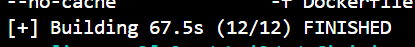
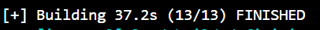

[유튜브](https://www.youtube.com/watch?v=tc713anE3UY&list=TLGGIaF3jDbrMJIyNDAzMjAyNQ)

[github](https://github.com/ArjanCodes/examples/tree/main/2025/efficient-python-dockerfile)


# Stages Of An Efficient Dockerfile

**Before running each dockerfile, place it in the leadspotr directory and the run the commands below in the same directory**

## Build commands

### 1. Build `Dockerfile.01`

```
cd Optimizing-Dockerfile/1-original-dockerfile/
```

```
docker build --build-arg DB_HOST=mydbhost \
             --build-arg DB_USER=mydbuser \
             --build-arg DB_PASSWORD=mydbpassword \
             --build-arg DB_NAME=mydbname \
             --build-arg ACCESS_TOKEN_SECRET_KEY=mysecretkey \
             --no-cache \
             -f Dockerfile . -t 01_original
```
**Running the image**
```
docker run -p 8080:8080 01_original
```


### 2. Build `Dockerfile.02_betterimg`

```
cd Optimizing-Dockerfile/2-better-base-image/
```

```
docker build --build-arg DB_HOST=mydbhost \
             --build-arg DB_USER=mydbuser \
             --build-arg DB_PASSWORD=mydbpassword \
             --build-arg DB_NAME=mydbname \
             --build-arg ACCESS_TOKEN_SECRET_KEY=mysecretkey \
             --no-cache \
             -f Dockerfile . -t 02_betterimg
```
**Running the image**
```
docker run -p 8080:8080 02_betterimg
```




### 3. Build `Dockerfile.03_imgtag`

```
cd Optimizing-Dockerfile/3-with-explicit-tag/
```

```
docker build --build-arg DB_HOST=mydbhost \
             --build-arg DB_USER=mydbuser \
             --build-arg DB_PASSWORD=mydbpassword \
             --build-arg DB_NAME=mydbname \
             --build-arg ACCESS_TOKEN_SECRET_KEY=mysecretkey \
             --no-cache \
             -f Dockerfile . -t 03_imgtag
```
**Running the image**
```
docker run -p 8080:8080 03_imgtag
```
### 4. Build `Dockerfile.04_limitdeps`

```
cd Optimizing-Dockerfile/4-without-recommended-installs/
```

```
docker build --build-arg DB_HOST=mydbhost \
             --build-arg DB_USER=mydbuser \
             --build-arg DB_PASSWORD=mydbpassword \
             --build-arg DB_NAME=mydbname \
             --build-arg ACCESS_TOKEN_SECRET_KEY=mysecretkey \
             --no-cache \
             -f Dockerfile . -t 04_limitdeps
```
**Running the image**
```
docker run -p 8080:8080 04_limitdeps
```
### 5. Build `Dockerfile.05_cleandeps`

```
cd Optimizing-Dockerfile/5-without-metadata/
```

```
docker build --build-arg DB_HOST=mydbhost \
             --build-arg DB_USER=mydbuser \
             --build-arg DB_PASSWORD=mydbpassword \
             --build-arg DB_NAME=mydbname \
             --build-arg ACCESS_TOKEN_SECRET_KEY=mysecretkey \
             --no-cache \
             -f Dockerfile . -t 05_cleandeps
```
**Running the image**
```
docker run -p 8080:8080 05_cleandeps
```
### 6. Build `Dockerfile.06_uv`

```
cd Optimizing-Dockerfile/6-uv-instead-of-poetry/
```

```
docker build --build-arg DB_HOST=mydbhost \
             --build-arg DB_USER=mydbuser \
             --build-arg DB_PASSWORD=mydbpassword \
             --build-arg DB_NAME=mydbname \
             --build-arg ACCESS_TOKEN_SECRET_KEY=mysecretkey \
             --no-cache \
             -f Dockerfile . -t 06_uv
```
**Running the image**
```
docker run -p 8080:8080 06_uv
```




### 7. Build `Dockerfile.07_multi`

```
cd Optimizing-Dockerfile/7-use-a-multi-stage-build/
```

```
docker build --build-arg DB_HOST=mydbhost \
             --build-arg DB_USER=mydbuser \
             --build-arg DB_PASSWORD=mydbpassword \
             --build-arg DB_NAME=mydbname \
             --build-arg ACCESS_TOKEN_SECRET_KEY=mysecretkey \
             --target=production \
            --no-cache \
             -f Dockerfile . -t 07_multi
```
**Running the image**
```
docker run -p 8080:8080 07_multi
```


### Build `Dockerfile.08_bettercopy`
```
docker build --build-arg DB_HOST=mydbhost \
             --build-arg DB_USER=mydbuser \
             --build-arg DB_PASSWORD=mydbpassword \
             --build-arg DB_NAME=mydbname \
             --build-arg ACCESS_TOKEN_SECRET_KEY=mysecretkey \
             --target=production \
             -f Dockerfile.08_bettercopy . -t 08_bettercopy
```
**Running the image**
```
docker run -p 8080:8080 08_bettercopy
```

### Build `Dockerfile.09_mountsecrets`
If you run into problems here, run the following commands before in your terminal:

```
export DB_PASSWORD="mydbpassword"
export DB_USER="mydbuser"
export DB_NAME="mydbname"
export DB_HOST="mydbhost"
export ACCESS_TOKEN_SECRET_KEY="mysecretkey"
```

```
docker build --secret id=DB_PASSWORD,env=DB_PASSWORD \
             --secret id=DB_USER,env=DB_USER \
             --secret id=DB_NAME,env=DB_NAME \
             --secret id=DB_HOST,env=DB_HOST \
             --secret id=ACCESS_TOKEN_SECRET_KEY,env=ACCESS_TOKEN_SECRET_KEY \
             --target=production \
             --no-cache \
             -f Dockerfile.09_mountsecrets . -t 09_mountsecrets
```
**Running the image**
```
docker run -p 8080:8080 09_mountsecrets 

```


# Docker에서 시크릿 마운트가 필요한 이유

도커에서 `--mount=type=secret` 옵션을 사용하여 시크릿을 마운트하는 것이 필요한 이유에 대해 설명해 드리겠습니다.

## 왜 시크릿 마운트가 필요한가?

### 1. 보안 강화

- **이미지에 비밀 정보 노출 방지**: 
  - ENV나 ARG로 비밀을 전달하면 도커 이미지 레이어에 그 정보가 저장됩니다.
  - 이미지를 조사하면(`docker history` 등) 비밀 정보가 그대로 노출될 수 있습니다.
  - 시크릿 마운트는 이미지에 비밀 정보를 저장하지 않습니다.

- **빌드 로그에서 비밀 노출 방지**:
  - 일반 환경변수는 빌드 로그에 노출될 수 있습니다.
  - 마운트된 시크릿은 빌드 로그에 나타나지 않습니다.

## 대안과 비교

### 대안 1: ENV 사용
```dockerfile
ENV DB_PASSWORD="secret_password"
```
문제점:
- 이미지에 비밀이 그대로 저장됨
- 이미지를 공유하면 비밀도 함께 공유됨

### 대안 2: ARG 사용
```dockerfile
ARG DB_PASSWORD
ENV DB_PASSWORD=${DB_PASSWORD}
```
문제점:
- 빌드 히스토리에 남음
- `docker history` 명령어로 볼 수 있음

### 대안 3: 실행 시 환경변수 주입
```bash
docker run -e DB_PASSWORD=secret 이미지명
```
장점:
- 이미지에 비밀이 저장되지 않음
단점:
- 빌드 시 비밀이 필요하면 사용할 수 없음


### Build `Dockerfile.10_final`
If you run into problems here, run the following commands before in your terminal:
```
export DB_PASSWORD="mydbpassword"
export DB_USER="mydbuser"
export DB_NAME="mydbname"
export DB_HOST="mydbhost"
export ACCESS_TOKEN_SECRET_KEY="mysecretkey"
```

```
docker build --secret id=DB_PASSWORD \
             --secret id=DB_USER \
             --secret id=DB_NAME \
             --secret id=DB_HOST \
             --secret id=ACCESS_TOKEN_SECRET_KEY \
             --target=production \
             -f Dockerfile.10_final . -t 10_final
```
**Running the image**
```
docker run -p 8080:8080 10_final
```